# Planazo — diagramas de arquitectura

Todos los diagramas están en [Mermaid](https://mermaid.js.org/) y GitHub los renderiza solo. Si cambias la arquitectura, cambia el diagrama en el mismo PR.

- Dominios y fronteras: [`dominios.md`](dominios.md) · Especificación por servicio: [`arquitectura.md`](arquitectura.md) · Seguridad: [`seguridad.md`](seguridad.md)

---

## 1 · Contexto del sistema

Quién usa Planazo y de qué sistemas externos depende.

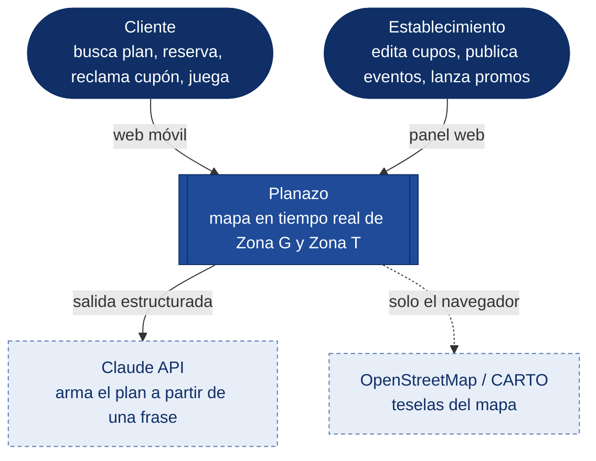

---

## 2 · Componentes (contenedores)

Un contenedor por proceso desplegable. Las líneas continuas son HTTP; las punteadas, WebSocket; las gruesas, el bus de eventos.

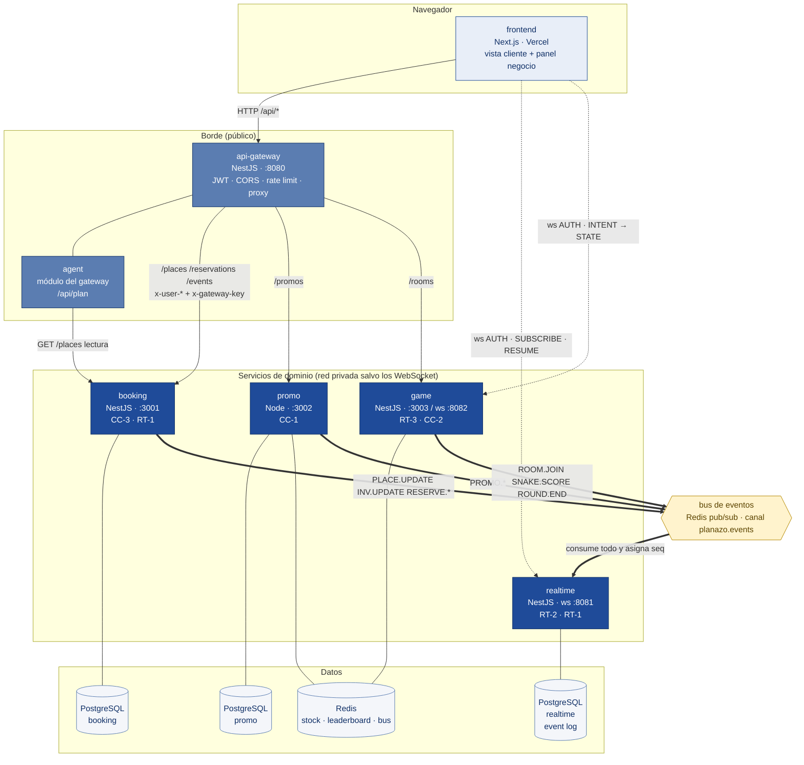

Lectura rápida:

- **Dos puertas de entrada**, no una: HTTP por el gateway; WebSocket directo a `realtime` y `game`. Un proxy HTTP en medio de un canal de 20 Hz solo suma latencia.
- **Ningún servicio le habla a otro** salvo `agent → booking` (lectura). Todo lo demás son eventos.
- **Un Redis** hace tres papeles en el MVP (contador de `promo`, sorted set de `game`, bus). Si el pico de `promo` lo estorba, se separa el bus; hasta entonces es complejidad que no compra nada.

---

## 3 · Despliegue

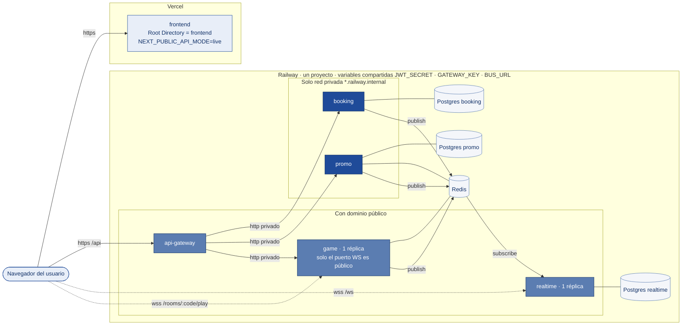

Decisiones:

- `booking` y `promo` **no tienen dominio público**: solo el gateway los alcanza por la red privada de Railway. Aunque alguien conociera su URL, sin `x-gateway-key` responden `401`.
- `game` necesita dominio público por el WebSocket; su HTTP también exige `x-gateway-key`, así que las rutas `/rooms` solo funcionan a través del gateway.
- `realtime` y `game` con **una réplica**: tienen estado en memoria (suscripciones, salas).
- `JWT_SECRET` y `GATEWAY_KEY` son **variables compartidas** del proyecto de Railway, no se pegan en cada servicio a mano ni viajan por chat.

---

## 4 · Secuencias de los seis retos

### 4.1 · CC-3 · Reservar el último cupo (lock optimista)

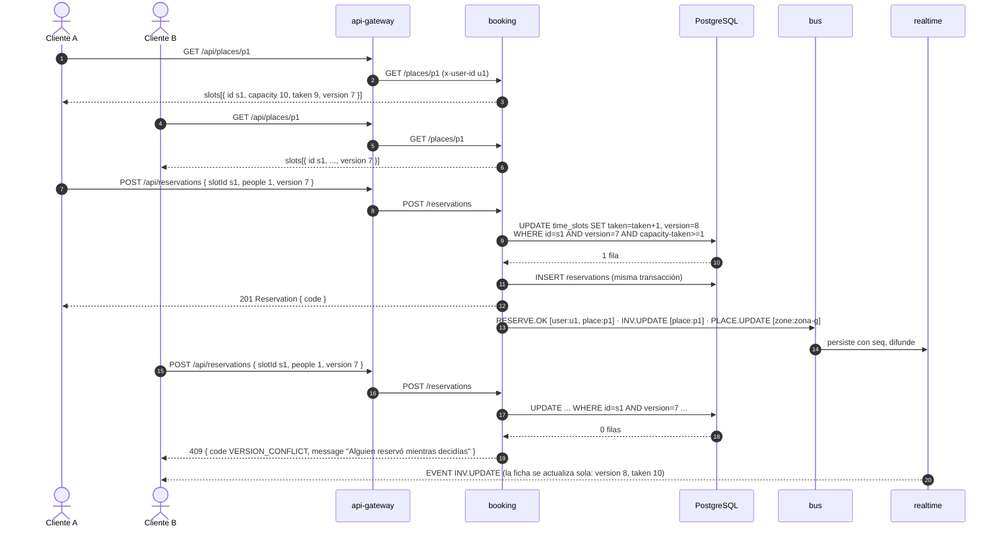

### 4.2 · CC-1 · Reclamar un cupón de stock finito (decremento atómico)

```mermaid
sequenceDiagram
  autonumber
  participant N as Negocio b1
  participant GW as api-gateway
  participant PR as promo
  participant RD as Redis
  participant PG as PostgreSQL
  participant BUS as bus
  participant RT as realtime
  actor C as 200 clientes

  N->>GW: POST /api/promos { placeId p7, title, discount "2x1", stock 10, durationS 120 }
  GW->>PR: POST /promos (x-user-role negocio, x-user-place-id p7)
  PR->>PG: INSERT promos
  PR->>RD: SET promo:{id}:stock 10 EX 120
  PR->>BUS: PROMO.PUSH [zone:zona-t]
  BUS->>RT: seq, difunde a zone:zona-t
  RT-->>C: EVENT PROMO.PUSH (aparece el toast)

  par 200 clicks casi simultáneos
    C->>GW: POST /api/promos/{id}/claim
    GW->>PR: POST /promos/{id}/claim
    PR->>RD: EVAL lua: DECR; si < 0 → INCR y -1
    alt quedó unidad (>= 0)
      PR->>PG: INSERT coupons
      PR->>BUS: PROMO.WON [user:uX, place:p7]
      PR-->>C: 200 Coupon { code }
    else se agotó (-1)
      PR->>BUS: PROMO.REJECTED [user:uX]
      PR-->>C: 409 { code PROMO_AGOTADA, message "Se agotó, te avisamos de la próxima" }
    end
  end
  Note over PR,RD: Exactamente 10 × 200 y 190 × 409. Nunca 11 cupones.
```

### 4.3 · RT-2 · Desconexión y reanudación sin pérdida ni duplicados

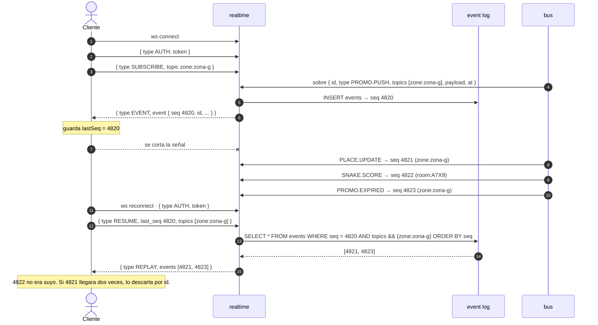

### 4.4 · RT-3 + CC-2 · Partida autoritativa a 20 Hz y marcador concurrente

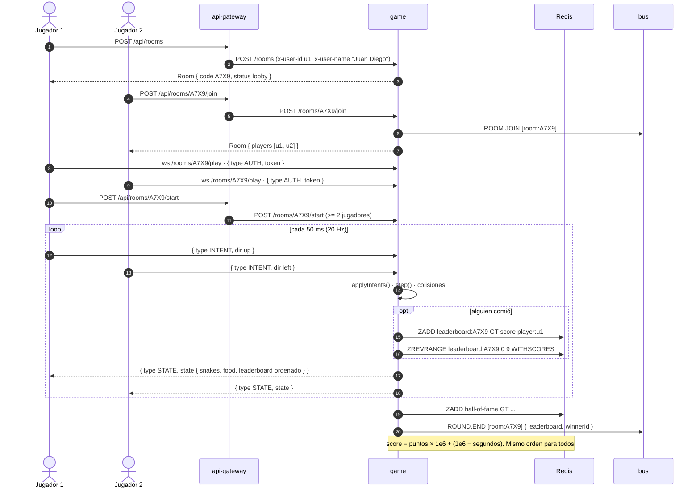

### 4.5 · Planificación · de una frase a una ruta

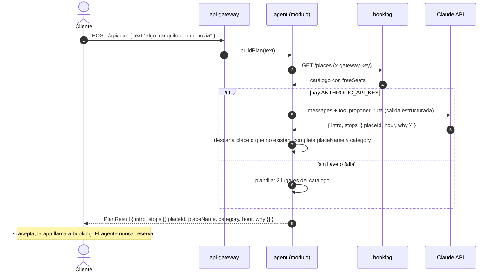

---

## 5 · Anatomía de un evento

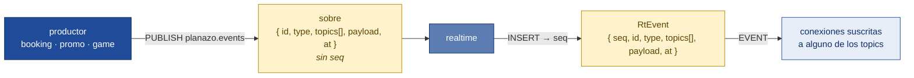

| Campo | Quién lo pone | Para qué |
|---|---|---|
| `id` | el productor (UUID v4) | descartar duplicados en `realtime` y en el cliente |
| `type` | el productor | `PLACE.UPDATE`, `PROMO.PUSH`, `SNAKE.SCORE`… |
| `topics[]` | el productor | a quién va: `zone:zona-g`, `place:p7`, `user:u1`, `room:A7X9` |
| `payload` | el productor | el contenido, **plano**, con la forma de `types.ts` (`PROMO.PUSH` → `Promo`, `RESERVE.OK` → `Reservation`, `INV.UPDATE` → `{ placeId, slot }`) |
| `at` | el productor (epoch ms) | cuándo pasó |
| `seq` | **solo `realtime`** al persistir | orden global y punto de reanudación |

Esquema formal: `planazo-infra/contracts/events.schema.json`.

---

## 6 · Modelo de datos por servicio

Cada servicio tiene su propia base. No hay llaves foráneas entre servicios: las referencias cruzadas (`placeId`, `userId`) son identificadores de texto que solo el dueño valida.

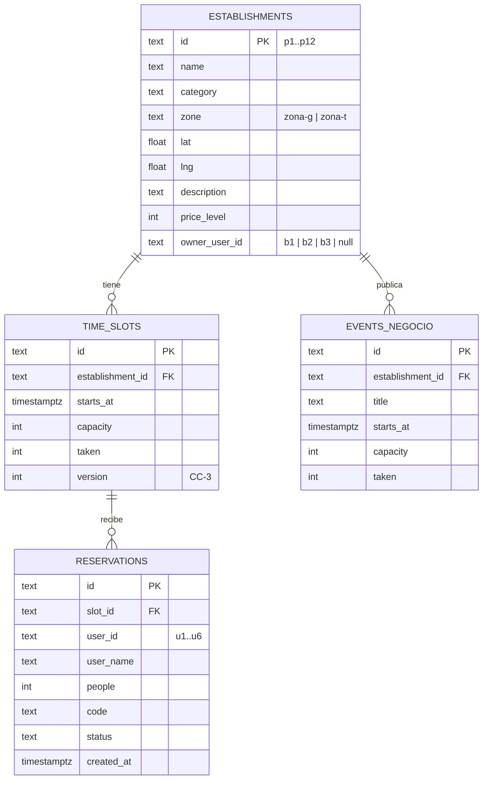

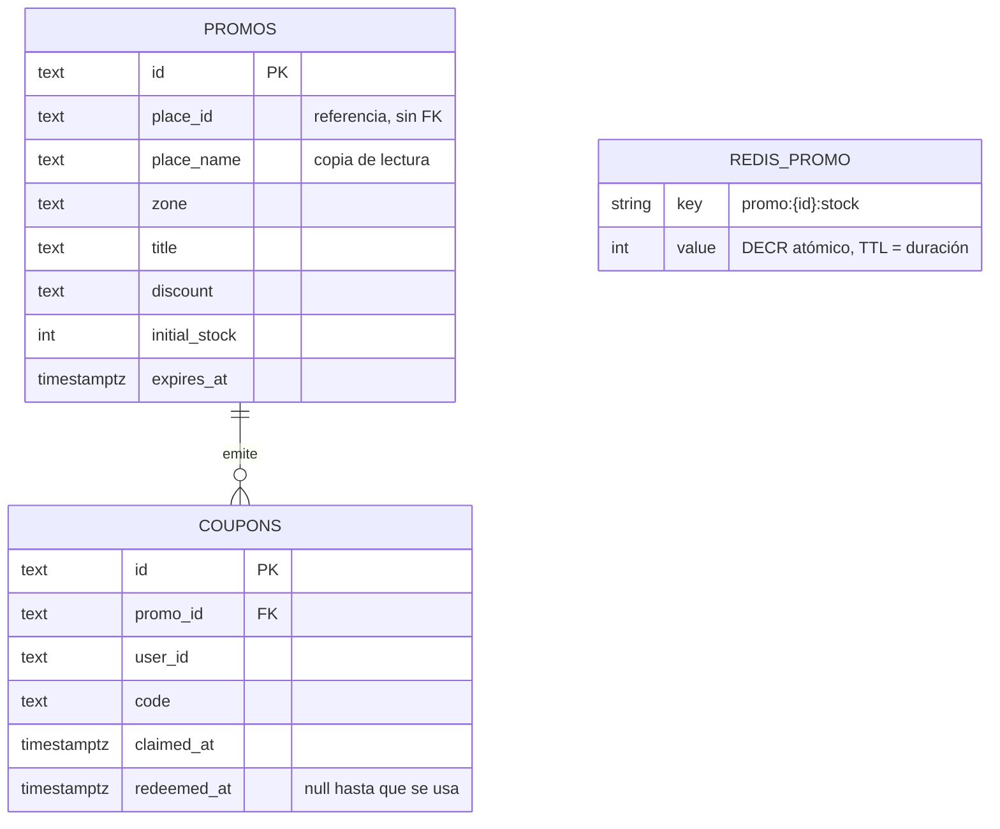

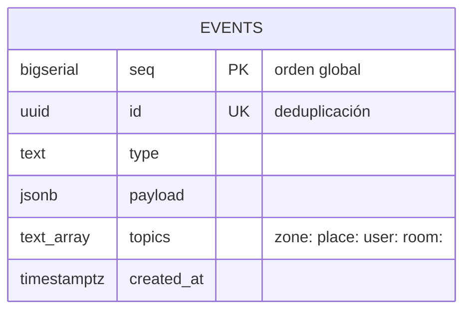

`game` no tiene PostgreSQL. En memoria: `rooms[code] = { hostId, status, players[], snakes, food, tick, endsAt }`. En Redis: `leaderboard:{code}` y `hall-of-fame` como sorted sets.

---

## 7 · Repositorios y flujo de trabajo

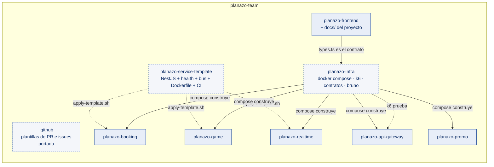

Cada repo: `main` protegida, PR con 1 aprobación y check `ci` verde, squash merge, CODEOWNERS pide revisión al dueño, Dependabot semanal. Detalle en [`plan-organizacion.md`](plan-organizacion.md).
