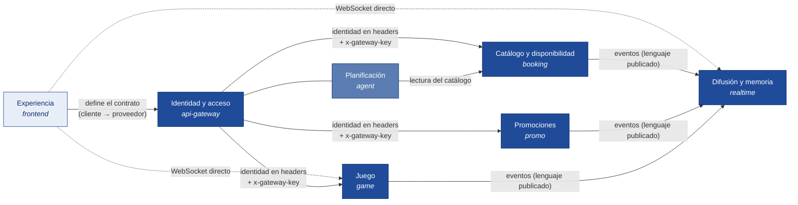

# Planazo — mapa de dominios

Este documento fija **qué dominios existen, qué posee cada uno y quién es su dueño**. Es la base para que cada microservicio tenga fronteras claras: si un dato o una regla no aparece aquí bajo un dominio, no está en ningún servicio y hay que decidir dónde va antes de programarlo.

- Diagramas: [`diagramas.md`](diagramas.md) · Especificación técnica: [`arquitectura.md`](arquitectura.md) · Contexto: [`contexto.md`](contexto.md)

---

## 1 · Los siete dominios

| # | Dominio | Pregunta que responde | Servicio | Dueño | Estado |
|---|---|---|---|---|---|
| 1 | **Identidad y acceso** | ¿Quién eres y qué rol tienes? | `api-gateway` | Juan Diego Melo | Núcleo mínimo (demo) |
| 2 | **Catálogo y disponibilidad** | ¿Qué lugares hay y cuántos cupos quedan? | `booking` | Fabián Andrade | Núcleo · CC-3 · RT-1 |
| 3 | **Promociones** | ¿Qué ofertas hay y quién alcanzó cupón? | `promo` | Fabián Andrade | Núcleo · CC-1 |
| 4 | **Juego** | ¿Quién va ganando la partida? | `game` | Diego Rozo | Núcleo · RT-3 · CC-2 |
| 5 | **Difusión y memoria de eventos** | ¿Qué pasó, en qué orden, y a quién le importa? | `realtime` | Juan Camilo Melo | Núcleo · RT-2 · RT-1 |
| 6 | **Planificación** | ¿Qué plan armo con lo que me pediste? | módulo `agent` del gateway | Juan Diego Melo | Soporte (recortable) |
| 7 | **Experiencia** | ¿Cómo lo ve el cliente y el negocio? | `frontend` | Juan Diego Melo | Presentación |

**Núcleo** = dominios que cargan un reto evaluable. **Soporte** = ayuda a la experiencia pero no implementa ningún reto. Solo el de soporte se puede recortar.

### Por qué estos siete y no otros

El corte no es por entidad ("usuarios", "eventos") sino por dos criterios que ya están en `contexto.md` §5: **frontera de consistencia** (lo que se escribe en la misma transacción va junto) y **perfil de ejecución** (lo que tiene una carga distinta va separado). Los siete de arriba son el resultado de aplicar esos criterios al producto:

- *Catálogo y disponibilidad* y *Promociones* parecen el mismo dominio ("recursos escasos del negocio") y no lo son: un cupón es un contador; un cupo es una franja con capacidad variable y editable. Distinto mecanismo, distinto pico de tráfico, distinto dominio.
- *Juego* tiene su propio reloj (20 Hz) y estado efímero. Nadie más en el sistema piensa en ticks.
- *Difusión* no sabe nada de negocio, pero es la **memoria** del sistema: sin ella no hay RT-2. Por eso es dominio, no infraestructura.
- *Identidad* existe como dominio aunque sea mínimo, para que quede explícito dónde vive la regla "un negocio administra exactamente un establecimiento" y para que, si algún día hay registro real, ya se sepa dónde va.

---

## 2 · Ficha de cada dominio

Cada ficha tiene la misma estructura: lenguaje (los términos que usa el equipo y el código), agregados (las cosas que se guardan y cambian juntas), invariantes (lo que nunca puede dejar de cumplirse), qué expone, qué publica, qué consume y qué **no** hace.

### 2.1 · Identidad y acceso — `api-gateway`

**Lenguaje:** usuario semilla · rol (`cliente`, `negocio`) · token · sesión · establecimiento administrado.

**Agregado:** `Usuario { id, name, role, placeId? }`. Nueve fijos: `u1`…`u6` clientes, `b1`…`b3` negocios. Viven en código (`seed-users.ts`), no en base de datos.

**Invariantes**
- Un usuario tiene exactamente un rol.
- Un usuario `negocio` administra exactamente un establecimiento; un `cliente`, ninguno.
- El token lleva `sub`, `name`, `role`, `placeId` y vence a los 7 días. Lo firma solo el gateway.

**Expone:** `POST /api/auth/demo { userId } → { token }`.
**Traduce identidad a headers** para los demás: `x-user-id`, `x-user-name`, `x-user-role`, `x-user-place-id`, y firma la petición con `x-gateway-key`.
**Publica:** nada.
**Consume:** nada.

**No hace:** registro, contraseñas, recuperación, perfiles. No existe en el MVP y no se simula.

---

### 2.2 · Catálogo y disponibilidad — `booking`

**Lenguaje:** establecimiento (o *lugar*) · zona (`zona-g`, `zona-t`) · categoría · franja horaria · cupo · capacidad · ocupados (`taken`) · versión · reserva · código de reserva · evento del negocio.

**Agregados**
- `Establecimiento` (raíz) → `Franjas[]`, `EventosDelNegocio[]`. Es la **fuente de verdad de la disponibilidad**.
- `Reserva { id, slotId, userId, userName, people, code, status, createdAt }`. Se crea en la **misma transacción** que actualiza la franja; por eso vive aquí y no en un "servicio de reservas".

**Invariantes**
- `0 ≤ taken ≤ capacity` en toda franja, siempre. Es la definición de "cero sobreventas".
- Una reserva solo se crea si la `version` que trae el cliente es la actual. Si no, `409 VERSION_CONFLICT` y nadie escribe.
- Si la franja no alcanza para `people`, `409 SIN_CUPO`.
- El negocio no puede bajar la capacidad por debajo de lo ya reservado: `409 CAPACIDAD_MENOR`.
- Cada escritura sobre una franja incrementa `version` en 1. Nunca se reutiliza ni se reinicia.

**Expone** (todas sin `/api`; el gateway lo quita): `GET /places`, `GET /places/:id`, `POST /reservations`, `GET /reservations/mine`, `GET /places/:id/reservations`, `PATCH /places/:id/slots/:sid`, `POST /events`.
**Publica:** `PLACE.UPDATE` (resumen para el mapa, tópico `zone:`), `INV.UPDATE` (franja completa, tópico `place:`), `RESERVE.OK` y `RESERVE.CONFLICT` (tópicos `user:` y `place:`).
**Consume:** nada del bus. Lee `x-user-*` del gateway.

**Datos de referencia que posee:** el catálogo semilla (`p1`…`p12`) con nombre, categoría, zona, coordenadas, descripción, nivel de precio, franjas y eventos. Es el **maestro** de esos datos; los demás dominios pueden tener una copia de lectura (ver §3).

**No hace:** WebSockets, promociones, juego, decidir quién ve qué. Publica y se olvida.

---

### 2.3 · Promociones — `promo`

**Lenguaje:** promoción · descuento · stock · stock inicial · reclamar · cupón · código de cupón · vencimiento · agotada.

**Agregados**
- `Promoción { id, placeId, placeName, zone, title, discount, stock, initialStock, expiresAt }`. El contador `stock` vive en Redis; el resto en PostgreSQL.
- `Cupón { id, promoId, userId, code, title, discount, placeName, claimedAt }`.

**Invariantes**
- Cupones emitidos de una promoción `≤ initialStock`. Siempre. Ese es CC-1.
- El contador nunca queda por debajo de cero (el script Lua deshace el `DECR`).
- Una promoción vencida no acepta reclamos: `409 PROMO_VENCIDA`. Una agotada: `409 PROMO_AGOTADA`.
- El cupón se persiste **solo después** de que Redis confirmó la unidad. Si Postgres falla después, se devuelve la unidad (`INCR`) y se responde error; nunca un éxito sin cupón guardado.
- Solo un `negocio` lanza promociones, y solo para su propio `placeId`.

**Expone:** `GET /promos?zone=`, `POST /promos`, `POST /promos/:id/claim`, `GET /promos/mine`.
**Publica:** `PROMO.PUSH` y `PROMO.EXPIRED` (tópico `zone:`), `PROMO.WON` y `PROMO.REJECTED` (tópicos `user:` y `place:`).
**Consume:** nada del bus.

**Datos de referencia que usa:** nombre y zona de los 12 establecimientos, para poder responder `placeName` y `zone` sin llamar a `booking`. Copia de lectura desde el mismo seed (§3).

**No hace:** notificaciones, event log propio, interfaz de usuario, decidir quién ve la promoción. Publica al bus con la zona y `realtime` enruta.

---

### 2.4 · Juego — `game`

**Lenguaje:** sala · código de sala (4 letras) · anfitrión · jugador · intención (`up/down/left/right`) · tick · serpiente · comida · marcador (leaderboard) · ronda · salón de la fama.

**Agregados**
- `Sala { code, hostId, status: lobby|playing|finished, players[] }` con su estado de partida `{ snakes, food, tick, endsAt }`. Vive en **memoria**: si el proceso muere, la partida muere y no pasa nada.
- `Marcador` de la sala: sorted set en Redis `leaderboard:{code}`.
- `SalónDeLaFama`: puntajes finales registrados, sorted set global en Redis.

**Invariantes**
- Solo el servidor mueve las serpientes. El cliente envía intenciones, nunca posiciones. Es RT-3.
- Una sala arranca con **≥ 2 jugadores** (`409 JUGADORES_INSUFICIENTES`); una sala `playing` no acepta entradas (`409 SALA_EN_JUEGO`); un código que no existe es `404 SALA_NO_EXISTE`.
- El marcador solo sube (`ZADD GT`) y todos los clientes ven el **mismo orden**, resuelto por el servidor con desempate determinista. Es CC-2.
- El token del WebSocket llega en el **primer mensaje**, nunca en la URL. `game` lo verifica con el `JWT_SECRET` compartido.

**Expone:** HTTP `POST /rooms`, `POST /rooms/:code/join`, `POST /rooms/:code/start`, `GET /rooms/hall-of-fame` (vía gateway); WebSocket `/rooms/:code/play` (directo).
**Publica:** `ROOM.JOIN`, `SNAKE.SCORE`, `ROUND.END` (tópico `room:`), para que quien mira el lobby desde la app se entere sin estar en el canal del juego.
**Consume:** nada del bus.

**No hace:** persistir partidas, conocer lugares ni promociones. Su relación con el resto del producto es solo el usuario que juega.

---

### 2.5 · Difusión y memoria de eventos — `realtime`

**Lenguaje:** evento · sobre · `seq` (orden global) · `id` (deduplicación) · tópico (`zone:`, `place:`, `user:`, `room:`) · suscripción · reanudación (`RESUME`) · reenvío (`REPLAY`).

**Agregado:** `RegistroDeEventos` (event log): tabla `events (seq, id, type, payload, topics[], created_at)`. Más, en memoria, `Conexión { userId, topics[], lastSeq }`.

**Invariantes**
- `seq` es estrictamente creciente y lo asigna **solo** `realtime` al persistir. Ningún productor manda `seq`.
- `id` es único: el mismo evento nunca se persiste dos veces aunque llegue dos veces del bus.
- Un evento se entrega únicamente a las conexiones suscritas a **al menos uno** de sus tópicos.
- `RESUME(last_seq, topics)` devuelve exactamente los eventos con `seq > last_seq` que intersecten esos tópicos, en orden. Ni uno menos (sin pérdida), ni repetidos (sin duplicados). Es RT-2.
- Solo se aceptan suscripciones a `user:<id>` del propio usuario del token.

**Expone:** WebSocket `/ws` con el protocolo `AUTH`, `SUBSCRIBE`, `UNSUBSCRIBE`, `RESUME` → `EVENT`, `REPLAY`.
**Publica:** nada al bus.
**Consume:** **todo** el canal `planazo.events`.

**No hace:** lógica de negocio. No sabe qué es un cupo ni una serpiente: enruta y recuerda.

---

### 2.6 · Planificación — módulo `agent` en `api-gateway`

**Lenguaje:** intención (la frase del usuario) · plan · parada · hora sugerida · motivo.

**Agregado:** ninguno. Sin estado. Opcionalmente una caché en Redis por `(zona, franja, hash de la intención)`.

**Invariantes**
- Solo propone lugares que existen en el catálogo; descarta cualquier `placeId` inventado por el modelo.
- Entre 2 y 3 paradas, en orden cronológico.
- **Nunca reserva.** Devuelve la propuesta; si el usuario acepta, la app llama a `booking`.
- Si el modelo no está disponible o falla, responde una plantilla sobre el catálogo con el mismo contrato. La app no distingue.

**Expone:** `POST /api/plan { text } → PlanResult { intro, stops[] }`.
**Consume:** `GET /places` de `booking` (lectura).

---

### 2.7 · Experiencia — `frontend`

**Lenguaje:** vista cliente (mapa, lugar, agente, juego, mis planes) · vista negocio (panel) · modo `mock` · modo `live` · sesión.

**Responsabilidad:** es el **consumidor** de todos los dominios y, por tanto, quien define el contrato ejecutable (`frontend/src/lib/types.ts` y `api/types.ts`). El modo `mock` es la referencia de comportamiento: lo que hace el mock es lo que debe hacer el servicio real.

**Invariantes propias**
- Ante `409`, relee y explica; nunca lo esconde.
- Guarda el último `seq`, reanuda al reconectar, descarta duplicados por `id`.
- Toma la `version` cuando el usuario **empieza a editar**, no cuando guarda.

---

## 3 · Datos de referencia compartidos

Hay datos que varios dominios necesitan **leer** pero que solo uno **escribe**. En el MVP se resuelven por **copia de lectura desde el mismo seed**, no por llamadas entre servicios:

| Dato | Maestro (escribe) | Copias de lectura | Cómo se mantiene igual |
|---|---|---|---|
| Establecimientos `p1`…`p12`: id, nombre, zona, categoría | `booking` | `promo` (nombre y zona) · `frontend` (modo mock) · `agent` (lee por HTTP) | Un solo archivo fuente: `frontend/src/lib/seed.ts`. Cada servicio lo copia en su `npm run seed`. Si cambia, cambia en todos en el mismo PR. |
| Usuarios semilla `u1`…`b3` | `api-gateway` | `frontend` (`session.ts`) · `booking` y `game` reciben el nombre por `x-user-name` | Dos archivos que deben coincidir: `seed-users.ts` y `session.ts`. |
| Zonas y categorías (enumeraciones) | `frontend/src/lib/types.ts` | todos | Son literales: `zona-g`, `zona-t`; `restaurante`, `bar`, `discoteca`, `hotel`, `evento`, `aire-libre`. |

Regla: **ningún servicio llama a otro para completar un nombre.** Si necesita un dato de referencia, lo tiene en su copia. La única lectura entre servicios permitida es `agent → booking`, porque el agente necesita disponibilidad en vivo y no tiene estado propio.

---

## 4 · Mapa de contexto (cómo se relacionan)

Tipos de relación:

- **Cliente → proveedor** (`frontend` → todos): el frontend es el cliente y fija el contrato. Los servicios se ajustan a él, no al revés.
- **Lenguaje publicado** (`booking`, `promo`, `game` → `realtime`): los productores hablan un formato común, el **sobre del evento**, y `realtime` lo entiende sin conocer su negocio. Está en `planazo-infra/contracts/events.schema.json`.
- **Conformista** (`api-gateway` → servicios): el gateway no transforma nada, solo autentica y reenvía.
- **Lectura** (`agent` → `booking`): la única llamada síncrona entre dominios de negocio, y es de solo lectura.

Lo que **no** existe y no debe aparecer: llamadas `booking ↔ promo`, `promo → realtime` por HTTP, `realtime → cualquiera`, ni escrituras cruzadas en bases de datos.

---

## 5 · Reglas de propiedad

1. **Cada dato tiene un solo dueño que escribe.** Las tablas de la §2 no se comparten entre servicios; cada uno tiene su PostgreSQL/Redis.
2. **Cada regla de negocio vive en el dominio de su agregado.** "¿Alcanza el cupo?" se decide en `booking`; "¿queda stock?" en `promo`; "¿puede arrancar la sala?" en `game`. Ni el gateway ni el frontend deciden.
3. **Los dominios se hablan por eventos, no por órdenes.** Un servicio publica lo que le pasó; nunca le dice a otro qué hacer.
4. **El contrato lo cambia un PR al frontend** (`types.ts` + `docs/contexto.md`) con la etiqueta `contrato`, y se replica a `planazo-infra/contracts/`. Nadie implementa un campo que no esté ahí.
5. **Un cambio de dominio se discute antes de programarse.** Si algo no encaja en ninguna ficha de la §2, se abre un issue con la etiqueta `necesita-decision` y se actualiza este documento.

---

## 6 · Lo que queda fuera (y dónde iría si entrara)

| Capacidad | Fuera del MVP | Dominio natural si se agrega |
|---|---|---|
| Registro, login con contraseña | ✅ | Identidad y acceso (se convertiría en servicio propio) |
| Reseñas y calificaciones | ✅ | Nuevo dominio: *Opinión* |
| Pagos, billetera de créditos | ✅ | Nuevo dominio: *Cobros* (nunca dentro de booking ni promo) |
| Notificaciones push fuera de la app | ✅ | Difusión (un nuevo *canal* del mismo dominio) |
| Métricas del negocio, pauta | ✅ | Nuevo dominio: *Analítica* (consume el event log de realtime) |
| Lista de espera | ✅ | Catálogo y disponibilidad (misma transacción que el cupo) |
